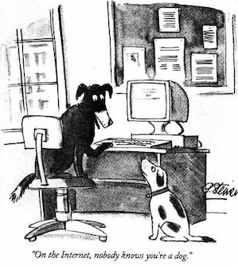

This is a blank Quartz installation.
See the [documentation](https://quartz.jzhao.xyz) for how to get started.

## ⚠️ 緊急報告：私の部屋の片付けが進まない件について

---

### 1. 現状の絶望度（定点観測）

> 「明日から本気出す」
> — *毎年言っている言葉（2026年最新版）*

現在、部屋の散らかり具合は**宇宙規模**に達しています。特にベッドの上の服の山は、もはや独自の生態系を築きつつあり、うかつに近づくと新種のキノコが生えていそうです。

---

### 2. 本日の進捗状況（大嘘）

* **積読（積まれた本）のタワー崩し：** `0%`（むしろ1冊増えた）
* **SNSのパトロール：** `150%`（異常なし。トレンドを完全把握）
* **お菓子の開封：** `100%`（ポテチがおいしい）
* **実際の片付け：** `0.00003%`（落ちていたペンを拾って机に置いた）

---

### 3. 言い訳マトリクス（徹底比較）

マークダウンのテーブル機能を使って、自分を正当化するための華麗な言い訳をまとめました。

| 言い訳のジャンル | 具体的な内容 | 説得力 | 自分へのダメージ |
| :--- | :--- | :---: | :---: |
| **スピリチュアル** | 「部屋の乱れは心の乱れ。つまり私の心は今、自由なのだ」 | ⭐︎ | 精神的勝利 |
| **物理学（ガチ）** | 「宇宙のエントロピー増大の法則に従っているだけ」 | ⭐︎⭐︎⭐︎⭐︎ | 現実逃避 |
| **直感型** | 「片付けちゃうと、どこに何があるか分からなくなる」 | ⭐︎⭐︎⭐︎⭐︎⭐︎ | **後に私物が遭難する** |

---

### 💡 最終結論

マークダウンをこんなに綺麗に整えている暇があったら、**今すぐ目の前のゴミを捨てなさい。**

